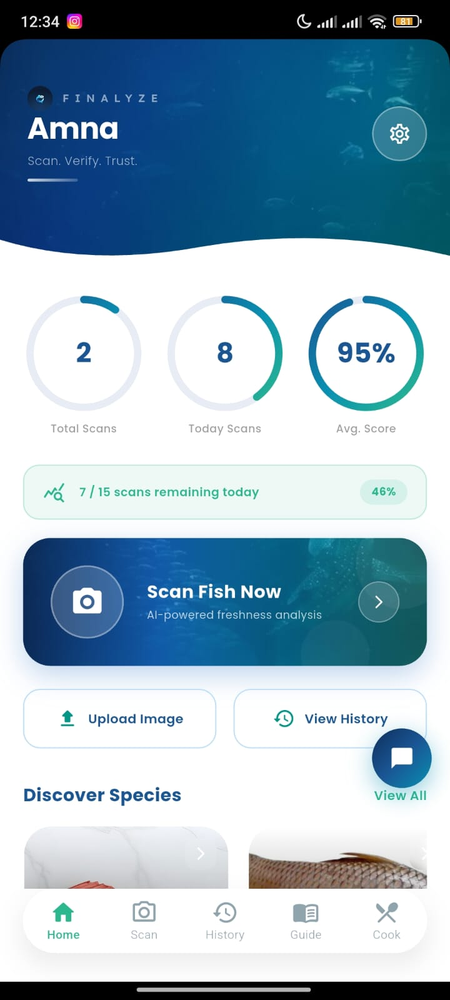
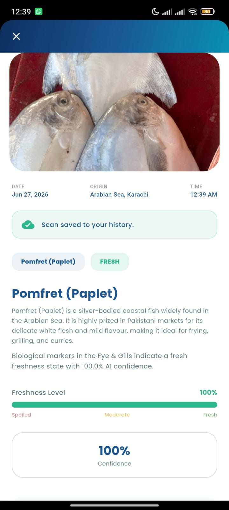
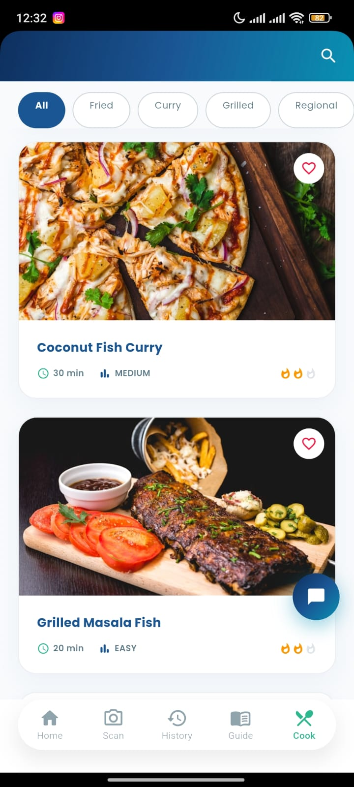
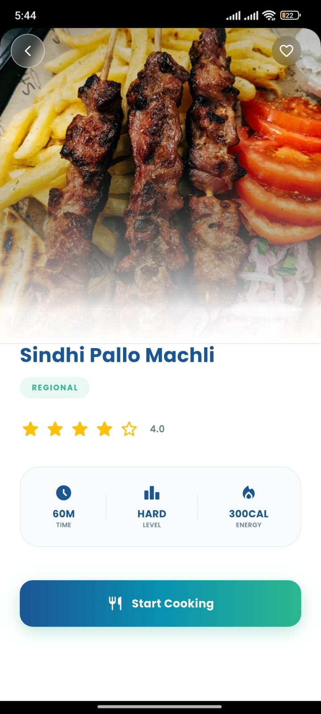
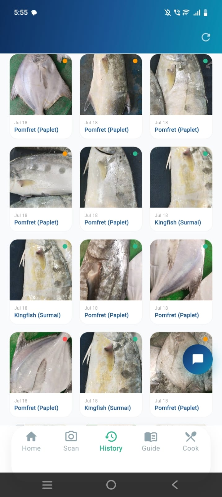
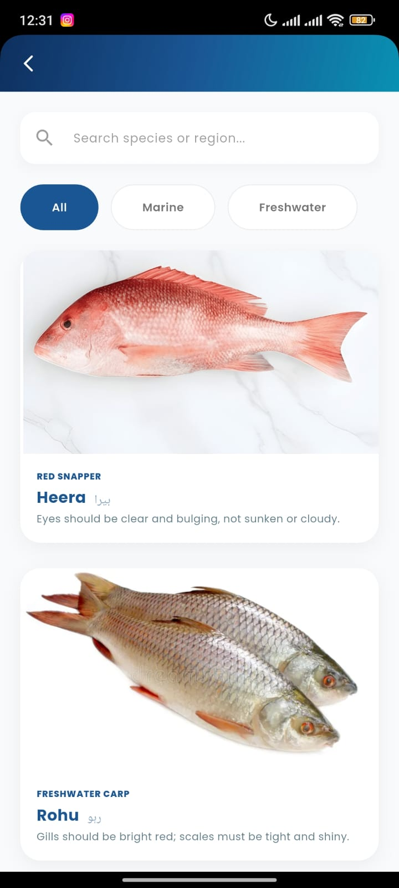

<div align="center">

# Finalyze

### AI-Powered Fish Freshness Detection & Recipe Companion

A mobile-first application that uses on-device deep learning to determine whether a fish is **fresh, moderate, or spoiled**, then guides the user from that result through to a finished, cooked meal.

[](https://flutter.dev)
[](https://nodejs.org)
[](https://www.mongodb.com)
[](https://www.tensorflow.org/lite)
[](#license)

</div>

---

## Overview

**Finalyze** addresses a common, practical problem: determining whether fish is safe to eat. Instead of relying on guesswork at the market or in the kitchen, users point their phone camera at a fish and receive an instant, AI-backed freshness verdict, powered by a custom-trained **MobileNetV2** convolutional neural network running entirely **on-device** via TensorFlow Lite.

Beyond detection, Finalyze closes the loop: it recommends recipes suited to the fish's condition, walks the user through a guided cooking flow, and maintains a personal scan history, favorites, and ratings, backed by a full authentication system and cloud-hosted backend.

This project was developed as a Final Year Project (FYP), combining computer vision, mobile engineering, and full-stack backend development into a single product.

---

## Screenshots

<div align="center">

| Home | Scan Result | Recipes |
|:---:|:---:|:---:|
|  |  |  |

| Cooking Flow | Scan History | Species Discovery |
|:---:|:---:|:---:|
|  |  |  |

</div>

---

## Key Features

| Category | Description |
|---|---|
| AI Detection | Real-time fish species and freshness classification (Fresh / Moderate / Spoiled) via an on-device TFLite model |
| Scan Editing | Crop and brightness-enhance a photo before analysis for better accuracy |
| Result Insights | Confidence score, freshness percentage, species description and origin |
| Scan History | Every scan is saved with image, species, confidence, and timestamp, with a full detail view |
| Recipe Engine | 14+ curated Pakistani fish recipes, filtered automatically by the scan's freshness result |
| Ratings & Favorites | Users can rate recipes and save favorites; top-rated recipes surface automatically |
| Guided Cooking Flow | Step-by-step ingredients-to-steps-to-rating flow with a live checklist |
| Species Discovery | Detailed profiles of fish species common to Pakistani waters |
| AI Chat Assistant | Built-in chatbot (Groq-powered) for freshness tips, species facts, and recipe help |
| Secure Authentication | Email/OTP verification, JWT-based sessions, password reset, and account deletion |
| Account Management | Editable profile with a persistent profile photo, security settings, and scan-limit tracking |
| Premium Tier | Unlockable premium experience with unlimited scans and enhanced AI analysis |

---

## The AI Model

The core of Finalyze is a fish species and freshness classifier trained via transfer learning.

- **Architecture:** MobileNetV2 (ImageNet pre-trained) → Global Average Pooling → Dense layers → Softmax, fine-tuned in two phases (frozen base, then partial unfreeze with a low learning rate).
- **Classes:** `data_invalid`, `pomfret_fresh`, `pomfret_moderate`, `pomfret_spoiled`, `surmai_fresh`, `surmai_moderate`, `surmai_spoiled`
- **Input:** 224×224 RGB images
- **Training:** Google Colab, TensorFlow/Keras, with augmentation (rotation, shifts, shear, zoom, brightness, horizontal flip)
- **Deployment format:** Converted to TensorFlow Lite (`.tflite`) for fast, private, fully offline on-device inference within the Flutter app

### Dataset

The model was trained on a custom-curated dataset of fish images labeled by species (Pomfret, Kingfish/Surmai) and freshness stage (fresh, moderate, spoiled), plus a `data_invalid` class to reject non-fish or irrelevant images.

> **Dataset (Google Drive):** [ADD DATASET LINK HERE]

### Model Assets

| File | Purpose |
|---|---|
| `assets/model/fish_file_11.tflite` | Final quantized TFLite model bundled with the app |
| `assets/model/labels.txt` | Class label mapping used at inference time |
| `assets/model/train.py` | Training and fine-tuning script (Keras/TensorFlow) |
| `assets/model/predict.py` | Standalone inference/testing script with confidence breakdown |
| `assets/model/convert_tfile.py` | Keras to TFLite conversion script |

---

## Architecture

```
┌─────────────────────┐        HTTPS/REST        ┌──────────────────────────┐
│   Flutter Mobile App │ ────────────────────────▶│  Node.js / Express API   │
│                      │◀──────────────────────── │   (hosted on Vercel)     │
│  • Camera & Scan UI  │                           │                          │
│  • On-device TFLite  │                           │  • Auth (JWT + OTP)      │
│    inference         │                           │  • Scan history          │
│  • Recipes & Guide   │                           │  • Scan-limit tracking   │
│  • Local persistence │                           │  • Profile management    │
└──────────┬───────────┘                           └────────────┬─────────────┘
           │                                                     │
           │ SharedPreferences /                                 │ Mongoose
           │ local file storage                                  ▼
           ▼                                              ┌────────────┐
   Offline-first UX                                        │  MongoDB   │
   (favorites, ratings,                                     │  Atlas     │
    profile photo, etc.)                                    └────────────┘
```

AI inference is performed entirely on-device; only account, scan-history, and profile data are synced to the backend.

---

## Frontend — Flutter Application

Located at the project root (`lib/`), built with Flutter for a single codebase across Android and iOS.

**Highlights:**
- Custom camera/scan pipeline with crop and brightness enhancement prior to inference
- On-device inference via [`tflite_v2`](https://pub.dev/packages/tflite_v2)
- Modular screen structure (`auth/`, `screens/home`, `screens/result`, `screens/cook`, `screens/history`, `screens/species`, `screens/chat`, `screens/premium`, etc.)
- Local persistence via `shared_preferences` for favorites, ratings, profile photo, and scan-limit caching
- Responsive UI using `google_fonts` and shared sizing helpers for consistent scaling across devices

**Key packages:** `camera`, `image_picker`, `image`, `tflite_v2`, `path_provider`, `http`, `flutter_dotenv`, `shared_preferences`, `audioplayers`, `video_player`

---

## Backend — Node.js API

Located at `finalyze_backend/`, an Express REST API deployed on Vercel, backed by MongoDB.

**Responsibilities:**
- Authentication — signup/signin, email-based OTP verification, password reset, JWT sessions
- Profile management — update profile, change password, delete account
- Scan history — save and retrieve scan records with full detail
- Scan-limit enforcement — rolling 24-hour scan quota per user
- Transactional email via Nodemailer for OTP delivery

**Tech stack:** `express`, `mongoose`, `jsonwebtoken`, `bcryptjs`, `nodemailer`, `multer`, `cors`, `dotenv`

**Structure:**
```
finalyze_backend/
├── models/        # Mongoose schemas (User, Scan)
├── routes/        # auth.js, scan.js
├── services/      # emailService.js (OTP emails)
├── utils/         # otpHelper.js
└── server.js      # App entry point
```

---

## Getting Started

### Prerequisites
- [Flutter SDK](https://docs.flutter.dev/get-started/install) (^3.9.2)
- [Node.js](https://nodejs.org) (LTS) and npm
- A MongoDB instance (local or [MongoDB Atlas](https://www.mongodb.com/atlas))

### 1. Clone the repository
```bash
git clone https://github.com/Amna-Liaqat-Ali/Finalyze.git
cd Finalyze
```

### 2. Backend setup
```bash
cd finalyze_backend
npm install
cp .env.example .env   # fill in MONGO_URI, SMTP credentials, JWT secret, etc.
npm run dev             # starts the API with nodemon
```

### 3. Frontend setup
```bash
cd ..                   # back to project root
flutter pub get
flutter run              # launches on a connected device/emulator
```

> The app points to a deployed backend by default via `lib/core/api_config.dart`. Update `baseUrl` there to run against a local backend.

### 4. Retraining or re-exporting the model (optional)
```bash
cd assets/model
# train.py and predict.py are designed to run in Google Colab
# with the dataset mounted from Google Drive
python convert_tfile.py   # exports a fresh fish_file_11.tflite
```

---

## Tech Stack Summary

| Layer | Technology |
|---|---|
| Mobile Frontend | Flutter (Dart) |
| On-device AI | TensorFlow Lite, MobileNetV2 |
| Model Training | TensorFlow / Keras, Google Colab |
| Backend API | Node.js, Express |
| Database | MongoDB (Mongoose ODM) |
| Authentication | JWT + Email OTP |
| Hosting | Vercel (backend) |
| AI Chat Assistant | Groq API |

---

## Project Structure

```
FYP/
└── Finalyze/
    ├── lib/                     # Flutter application source
    │   ├── auth/                # Login, signup, OTP, password reset
    │   ├── core/                 # Config, session, local stores, utilities
    │   ├── screens/
    │   │   ├── home/              # Home dashboard, settings, account
    │   │   ├── result/             # Scan capture, edit, review, results
    │   │   ├── cook/               # Recipes, favorites, cooking flow
    │   │   ├── history/            # Scan history
    │   │   ├── species/            # Species discovery
    │   │   ├── chat/                # AI chat assistant
    │   │   ├── premium/             # Premium tier
    │   │   └── guide/               # How-to-use guide
    │   └── widgets/                 # Shared UI components
    ├── assets/
    │   └── model/                    # TFLite model, labels, training scripts
    └── finalyze_backend/            # Node.js/Express REST API
        ├── models/
        ├── routes/
        ├── services/
        └── utils/
```

---

## Roadmap

- [ ] Biometric login and two-factor authentication
- [ ] Support for additional fish species
- [ ] Cloud sync of favorites/ratings across devices
- [ ] Push notifications for scan-limit resets

---

## License

This project is developed as a Final Year Project for academic purposes. Contact the author for reuse or collaboration terms.

---

<div align="center">

**Amna Liaqat Ali**

</div>
